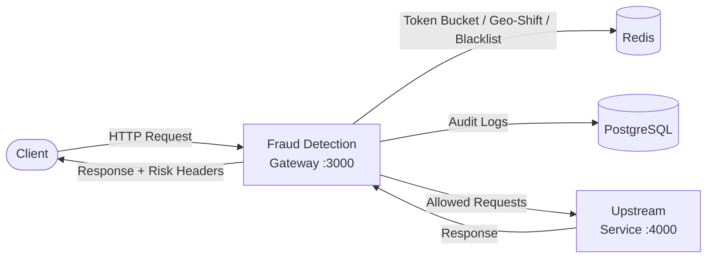
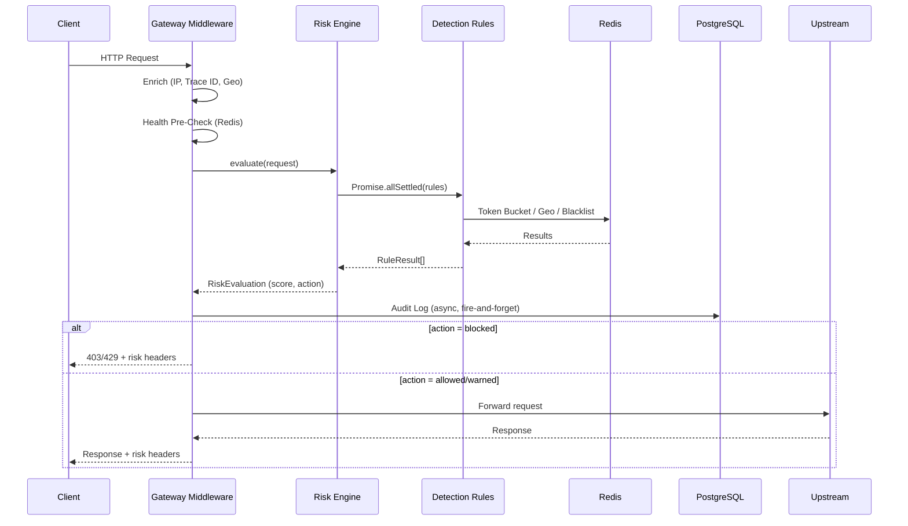

# Fraud Detection Gateway

A low-latency API middleware for **real-time threat detection and rate limiting**. The gateway sits between your clients and upstream services, evaluating every request against a pluggable set of detection rules before forwarding or blocking traffic.

## Architecture



### Request Lifecycle



## Features

| Feature | Description |
|---|---|
| **Token Bucket Rate Limiting** | Redis-backed atomic Lua script, per-IP, with graduated scoring |
| **Geo-Shift Detection** | Impossible travel detection via Haversine distance + time analysis |
| **Payload Inspection** | SQLi, XSS, path traversal, and command injection pattern matching |
| **IP Reputation** | Redis blacklist/suspicious sets + datacenter prefix matching |
| **Audit Logging** | Every request scored and logged to PostgreSQL with full metadata |
| **Admin API** | Dashboard metrics, rule toggling, blacklist management, audit logs |
| **Fail Modes** | Configurable fail-open (forward on infra failure) or fail-secure (block) |
| **Risk Headers** | Every response includes `X-Risk-Score`, `X-Risk-Action`, `X-Trace-Id` |

## Quick Start

### Prerequisites

- **Node.js** ≥ 18
- **Redis** ≥ 7
- **PostgreSQL** ≥ 14

### Option 1: Docker Compose (recommended)

```bash
# Start Redis, PostgreSQL, and the gateway
docker compose up -d

# Verify
curl http://localhost:3000/health
```

### Option 2: Local Development

```bash
# 1. Install dependencies
npm install

# 2. Copy environment config
cp .env.example .env
# Edit .env with your Redis/PostgreSQL connection details

# 3. Start Redis and PostgreSQL (if not already running)
# On macOS: brew services start redis && brew services start postgresql
# On Linux: sudo systemctl start redis postgresql
# On Windows: Start via Docker or WSL

# 4. Seed the blacklist (optional)
npm run seed:blacklist

# 5. Start the gateway in development mode
npm run dev
```

The gateway will start on `http://localhost:3000`.

## Environment Configuration

| Variable | Default | Description |
|---|---|---|
| `NODE_ENV` | `development` | Environment (`development`, `production`, `test`) |
| `PORT` | `3000` | HTTP server port |
| `LOG_LEVEL` | `info` | Winston log level |
| `REDIS_HOST` | `127.0.0.1` | Redis host |
| `REDIS_PORT` | `6379` | Redis port |
| `REDIS_PASSWORD` | *(empty)* | Redis password |
| `REDIS_DB` | `0` | Redis database index |
| `REDIS_KEY_PREFIX` | `fdg:` | Key prefix for all Redis keys |
| `PG_HOST` | `127.0.0.1` | PostgreSQL host |
| `PG_PORT` | `5432` | PostgreSQL port |
| `PG_USER` | `fdg_admin` | PostgreSQL user |
| `PG_PASSWORD` | `changeme` | PostgreSQL password |
| `PG_DATABASE` | `fraud_gateway` | PostgreSQL database name |
| `PG_POOL_MIN` | `2` | Minimum connection pool size |
| `PG_POOL_MAX` | `10` | Maximum connection pool size |
| `RISK_THRESHOLD_BLOCK` | `80` | Risk score at or above which requests are **blocked** |
| `RISK_THRESHOLD_WARN` | `50` | Risk score at or above which requests are **warned** |
| `RATE_LIMIT_MAX_TOKENS` | `100` | Token bucket capacity per IP |
| `RATE_LIMIT_REFILL_RATE` | `10` | Tokens refilled per interval |
| `RATE_LIMIT_REFILL_INTERVAL_MS` | `1000` | Refill interval (ms) |
| `RATE_LIMIT_WINDOW_MS` | `60000` | Rate limit window (ms) |
| `GEO_SHIFT_MAX_SPEED_KMH` | `1000` | Maximum plausible travel speed (km/h) |
| `GEO_SHIFT_WINDOW_MS` | `300000` | Geo observation retention window (ms) |
| `MAX_PAYLOAD_SIZE_BYTES` | `1048576` | Maximum request body size (bytes) |
| `UPSTREAM_TARGET` | `http://localhost:4000` | Upstream service URL to proxy to |
| `FAIL_MODE` | `open` | `open` = allow on infra failure, `secure` = block |

## API Endpoints

### Public

| Method | Path | Description |
|---|---|---|
| `GET` | `/health` | Gateway health check (pre-gateway, always available) |
| `*` | `/api/v1/proxy/*` | Proxied to upstream (evaluated by gateway middleware) |

### Admin API (`/api/v1/admin`)

| Method | Path | Description |
|---|---|---|
| `GET` | `/admin/health` | System health (Redis + PostgreSQL status) |
| `GET` | `/admin/metrics` | Aggregate dashboard metrics |
| `GET` | `/admin/metrics/timeline` | Time-series chart data |
| `GET` | `/admin/logs` | Paginated audit logs (filterable) |
| `GET` | `/admin/logs/:id` | Single audit log by ID |
| `DELETE` | `/admin/logs` | Purge old audit logs |
| `GET` | `/admin/rules` | List all detection rules |
| `PATCH` | `/admin/rules/:name` | Enable/disable a rule |
| `GET` | `/admin/blacklist` | Get all blacklisted IPs |
| `POST` | `/admin/blacklist` | Add IPs to blacklist |
| `DELETE` | `/admin/blacklist` | Remove IPs from blacklist |

### Response Headers

Every response passing through the gateway includes:

| Header | Description |
|---|---|
| `X-Trace-Id` | Unique request correlation ID (UUID v4) |
| `X-Risk-Score` | Total risk score (0–100) |
| `X-Risk-Action` | Enforcement action (`allowed`, `warned`, `blocked`) |
| `X-Evaluation-Time-Ms` | Time spent evaluating all rules (ms) |
| `X-Gateway-Version` | Gateway version |

## Detection Rules

### Rate Limiting (`rate-limit`)

- **Max Score:** 40
- **Mechanism:** Redis-backed token bucket (atomic Lua script)
- **Scoring:** Graduated — bucket >50% = 0, depleting = proportional, exhausted = 40
- **Bucket Key:** Per client IP

### Geo-Shift Detection (`geo-shift`)

- **Max Score:** 35
- **Mechanism:** Haversine distance + time analysis via Redis Lua script
- **Scoring:**
  - Speed ≤ threshold → 0
  - 1–2x threshold → 15 (suspicious)
  - 2–5x threshold → 25 (very suspicious)
  - \>5x threshold → 35 (impossible travel)

### Payload Inspection (`payload-size`)

- **Max Score:** 30
- **Mechanism:** Regex pattern matching against body and URL
- **Detects:** SQL injection, XSS, path traversal, command injection, oversized payloads

### IP Reputation (`ip-reputation`)

- **Max Score:** 30
- **Mechanism:** Redis set lookups + prefix matching
- **Scoring:**
  - Blacklisted IP → 30
  - Datacenter/VPN range → 15
  - Suspicious list → 10
  - Clean → 0

### Score Aggregation

Scores from all rules are summed (capped at 100) and mapped to an action:

| Total Score | Action |
|---|---|
| 0–49 | `allowed` |
| 50–79 | `warned` (forwarded with caution log) |
| 80–100 | `blocked` (403 or 429 response) |

## Testing

### Run All Tests

```bash
npm test
```

### Run Unit Tests Only

```bash
npm run test:unit
```

### Run Integration Tests Only

```bash
npm run test:integration
```

### Attack Simulation (Load Test)

The attack simulation script fires crafted requests against a running gateway to exercise all detection rules:

```bash
# First, start the gateway
npm run dev

# In another terminal, run the simulation
npm run simulate:attack
```

The simulation covers:
- Normal baseline traffic
- SQL injection payloads
- XSS attack patterns
- Path traversal
- Command injection
- Blacklisted IP traffic
- Geo-shift (impossible travel)
- Rate-limit flooding (120 rapid requests)
- Oversized payloads

## Project Structure

```
src/
├── app.ts                          # Application entry point
├── config/
│   ├── env.ts                      # Zod-validated environment config
│   ├── redis.ts                    # Redis client + Lua scripts
│   ├── database.ts                 # Knex/PostgreSQL setup + schema
│   └── logger.ts                   # Winston logger
├── core/
│   ├── gateway.middleware.ts       # Primary request interception middleware
│   ├── risk-engine.ts              # Central scoring engine (orchestrator)
│   └── token-bucket.ts             # Redis-backed token bucket rate limiter
├── rules/
│   ├── rate-limit.rule.ts          # Volumetric rate limiting
│   ├── geo-shift.rule.ts           # Impossible travel detection
│   ├── payload-size.rule.ts        # SQLi/XSS/traversal inspection
│   └── ip-reputation.rule.ts       # IP blacklist/reputation checks
├── controllers/
│   ├── metrics.controller.ts       # Dashboard metrics queries
│   └── logs.controller.ts          # Audit log CRUD
├── routes/
│   ├── admin.routes.ts             # Admin API routes
│   └── proxy.routes.ts             # Upstream proxy routes
├── types/
│   ├── request-context.ts          # Extended Express Request type
│   ├── risk-score.ts               # Risk evaluation types
│   └── rule.interface.ts           # Detection rule contract
└── utils/
    ├── geoip.ts                    # GeoIP lookup + Haversine formula
    └── ip-lookup.ts                # Client IP extraction

scripts/
├── seed-blacklist.ts               # Populate Redis with sample threat data
└── attack-simulation.ts            # Load test / attack simulation

tests/
├── unit/                           # Unit tests (mocked dependencies)
│   ├── risk-engine.test.ts
│   ├── ip-lookup.test.ts
│   ├── geoip.test.ts
│   ├── payload-size.rule.test.ts
│   ├── rate-limit.rule.test.ts
│   ├── geo-shift.rule.test.ts
│   └── ip-reputation.rule.test.ts
└── integration/                    # Integration tests (supertest)
    └── gateway.test.ts
```

## Deployment

### Docker

```bash
# Build and run with Docker Compose
docker compose up -d --build

# View logs
docker compose logs -f gateway
```

### Production Considerations

- Set `NODE_ENV=production` for structured JSON logging
- Set `FAIL_MODE=secure` in high-security environments
- Configure `REDIS_PASSWORD` and `PG_PASSWORD` with strong credentials
- Place behind a load balancer / reverse proxy (Nginx, Cloudflare)
- Set `trust proxy` appropriately for your proxy chain
- Monitor `X-Evaluation-Time-Ms` — target is <15ms per request

## License

MIT
